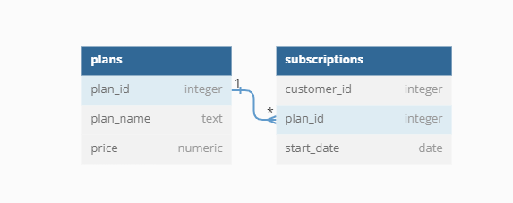

# **Case Study #3 - Foode-Fi**

## **Introduction:**

Subscription based businesses are super popular and Danny realised that there was a large gap in the market - he wanted to create a new streaming service that only had food related content - something like Netflix but with only cooking shows!

Danny finds a few smart friends to launch his new startup Foodie-Fi in 2020 and started selling monthly and annual subscriptions, giving their customers unlimited on-demand access to exclusive food videos from around the world!

Danny created Foodie-Fi with a data driven mindset and wanted to ensure all future investment decisions and new features were decided using data. This case study focuses on using subscription style digital data to answer important business questions.

## **Data:**

The data set consists of two tables namely 'plans' & 'subscriptions' with the following relationship:

 

Below are snippets for each of the table:

### **plans**

| **plan_id** | **plan_name** | **price** |
| ----------: | ------------- | --------: |
|           0 | trial         |         0 |
|           1 | basic monthly |       9.9 |
|           2 | pro monthly   |      19.9 |
|           3 | pro annual    |       199 |
|           4 | churn         |           |

 

### **subscriptions**

| **customer_id** | **plan_id** | **start_date** |
| --------------: | ----------: | -------------- |
|             439 |           4 | 04/05/2020     |
|             320 |           3 | 04/04/2021     |
|             177 |           4 | 09/09/2020     |
|             159 |           0 | 09/09/2020     |
|             492 |           0 | 27/02/2020     |
|              13 |           0 | 15/12/2020     |
|             338 |           0 | 12/12/2020     |
|             294 |           4 | 26/01/2020     |
|             324 |           1 | 14/05/2020     |
|             174 |           0 | 01/02/2020     |

 

## **Solutions:**

[Customer Journey](./schema-solution/a-CustomerJourney.md)

[Data Analysis Questions](./schema-solution/b-DataAnalysisQuestions.md)

[Challenge Payment Question](./schema-solution/c-ChallengePaymentQuestion.md)

[Outside the Box Question](./schema-solution/d-OutsideTheBoxQuestions.md)
