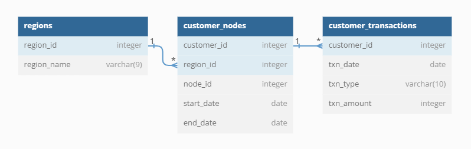

# **Case Study #4 - Data Bank**

## **Introduction:**

There is a new innovation in the financial industry called Neo-Banks: new aged digital only banks without physical branches. Danny thought that there should be some sort of intersection between these new age banks, cryptocurrency and the data world... so he decides to launch a new initiative - Data Bank!

Data Bank runs just like any other digital bank - but it isn’t only for banking activities, they also have the world’s most secure distributed data storage platform! Customers are allocated cloud data storage limits which are directly linked to how much money they have in their accounts. There are a few interesting caveats that go with this business model, and this is where the Data Bank team need your help!

The management team at Data Bank want to increase their total customer base - but also need some help tracking just how much data storage their customers will need. This case study is all about calculating metrics, growth and helping the business analyse their data in a smart way to better forecast and plan for their future developments!

## **Data:**

The dataset consists of two tables namely 'regions', 'customer_nodes' & 'customer_transactions' with the following relationship:

 

Below are snippets for each the table:

### **regions**

| **region_id** | **region_name** |
| ------------: | --------------- |
|             1 | Australia       |
|             2 | America         |
|             3 | Africa          |
|             4 | Asia            |
|             5 | Europe          |

 

### **customer_nodes**

| **customer_id** | **region_id** | **node_id** | **start_date** | **end_date** |
| --------------: | ------------: | ----------: | -------------- | ------------ |
|             357 |             4 |           2 | 04/03/2020     | 16/03/2020   |
|             476 |             3 |           2 | 01/03/2020     | 13/03/2020   |
|             405 |             4 |           4 | 04/01/2020     | 19/01/2020   |
|              66 |             1 |           2 | 07/02/2020     | 25/02/2020   |
|             251 |             2 |           1 | 08/04/2020     | 31/12/9999   |
|             374 |             2 |           4 | 10/02/2020     | 11/02/2020   |
|             233 |             2 |           5 | 28/02/2020     | 12/03/2020   |
|             140 |             1 |           1 | 11/02/2020     | 11/03/2020   |
|             433 |             4 |           3 | 15/02/2020     | 10/03/2020   |
|             193 |             5 |           5 | 12/01/2020     | 25/01/2020   |

 

### **customer_transactions**

| **customer_id** | **txn_date** | **txn_type** | **txn_amount** |
| --------------: | ------------ | ------------ | -------------: |
|              51 | 20/01/2020   | deposit      |            367 |
|             204 | 24/02/2020   | deposit      |            290 |
|             329 | 04/04/2020   | purchase     |            271 |
|             435 | 07/01/2020   | deposit      |             20 |
|              40 | 13/02/2020   | withdrawal   |            630 |
|             120 | 21/04/2020   | deposit      |            229 |
|             426 | 27/01/2020   | purchase     |            408 |
|             452 | 19/02/2020   | deposit      |            536 |
|              13 | 16/03/2020   | deposit      |             99 |
|             320 | 10/01/2020   | deposit      |            725 |

 

## **Solutions:**

[Customer Nodes Exploration](./schema-solution/a-CustomerNodesExploration.md)

[Customer Transactions](./schema-solution/b-CustomerTransactions.md)

[Data Allocation Challenge](./schema-solution/c-DataAllocationChallenge.md)

[Extra Challenge](./schema-solution/d-ExtraChallenge.md)

[Extension Request](./schema-solution/e-ExtensionRequest.md)
