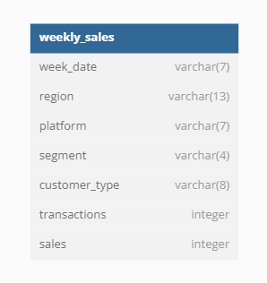

# **Case Study #5 - Data Mart**

## **Introduction:**

Data Mart is Danny’s latest venture and after running international operations for his online supermarket that specialises in fresh produce - Danny is asking for your support to analyse his sales performance.

In June 2020 - large scale supply changes were made at Data Mart. All Data Mart products now use sustainable packaging methods in every single step from the farm all the way to the customer.

Danny needs your help to quantify the impact of this change on the sales performance for Data Mart and it’s separate business areas. The key business question he wants you to help him answer are the following:

- What was the quantifiable impact of the changes introduced in June 2020?

- Which platform, region, segment and customer types were the most impacted by this change?

- What can we do about future introduction of similar sustainability updates to the business to minimise impact on sales?

## **Data:**

The dataset consists of only one table named 'weekly_sales'.

 

Below is the snippet for the table:

### **weekly_sales**

| **week_date** | **region**    | **platform** | **segment** | **customer_type** | **transactions** | **sales** |
| ------------- | ------------- | ------------ | ----------- | ----------------- | ---------------: | --------: |
| 15/07/2019    | USA           | Shopify      | C1          | Existing          |              713 |    125177 |
| 13/08/2018    | EUROPE        | Shopify      | C2          | New               |                6 |      1313 |
| 10/06/2019    | CANADA        | Retail       | C2          | New               |            13503 |    420973 |
| 26/03/2018    | SOUTH AMERICA | Shopify      | null        | Guest             |              780 |    156505 |
| 03/09/2018    | CANADA        | Shopify      | C2          | New               |               66 |     11483 |
| 17/06/2019    | EUROPE        | Shopify      | F2          | Existing          |              168 |     38847 |
| 24/06/2019    | SOUTH AMERICA | Retail       | C1          | New               |             2349 |     50350 |
| 10/08/2020    | AFRICA        | Shopify      | null        | New               |              279 |     46890 |
| 27/04/2020    | OCEANIA       | Shopify      | null        | Existing          |              637 |    121856 |
| 07/05/2018    | EUROPE        | Shopify      | F2          | Existing          |              166 |     44578 |

 

## **Solutions:**

[Data Cleansing Steps](./schema-solution/a-DataCleansingSteps.md)

[Data Exploration](./schema-solution/b-DataExploration.md)

[Before and After Analysis](./schema-solution/c-BeforeAndAfterAnalysis.md)

[Bonus Question](./schema-solution/d-BonusQuestion.md)
